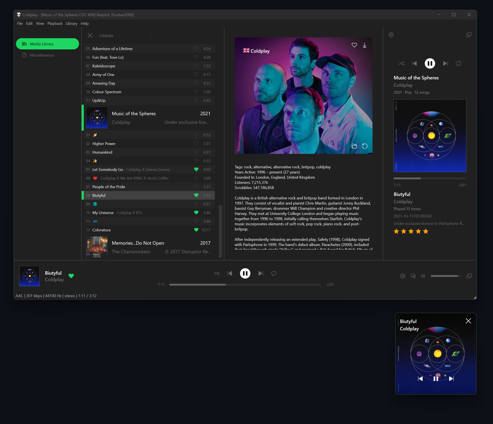

This is a simple 'Now Playing' mockup built with samples included in [marc2k3](https://github.com/marc2k3)'s [JScript Panel 3](https://github.com/jscript-panel/release/releases).

## Components

* [JScript Panel 3](https://github.com/jscript-panel/release/releases)
* [Flowin](https://github.com/ttsping/foo_flowin)
* [Playback Statistics](https://www.foobar2000.org/components/view/foo_playcount)

## Hotkeys

1. <kbd>Space</kbd>, Play/Pause
2. <kbd>→</kbd>, Ahead by 5 seconds
3. <kbd>←</kbd>, Back by 5 seconds
4. <kbd>Ctrl</kbd>+<kbd>Wheel</kbd>, Scaling layout (based on font size, ranging from 9 to 14)
5. <kbd>Ctrl</kbd>+<kbd>0</kbd>, Reset scaling (revert font size to 9)

## Notes

* If the flowing art panel is invisible on your monitor, go to <b>[View]-[Flowin]-[Picture in picture]-[Reset position]</b>, then hold the scroll button of your mouse on the panel to adjust the position
* Default biography cache file location is changed, you can edit yourself in file %fb2k_profile_path%user-scripts\js\common.js, go to line 477

## Screenshot

